# DeepBlue – Oceanographic Research & Climate Intelligence Platform
## Complete Enterprise-Grade DevOps Solution

---

> **Document Classification:** Final Year B.Tech DevOps Project  
> **Version:** 1.0.0  
> **Prepared By:** Senior Cloud Architect & DevOps Engineering Team  
> **Date:** June 2026  
> **Status:** Production-Ready Design Specification

---

## Table of Contents

1. [Executive Summary](#1-executive-summary)
2. [Business Requirements](#2-business-requirements)
3. [Functional Requirements](#3-functional-requirements)
4. [Non-Functional Requirements](#4-non-functional-requirements)
5. [System Architecture Diagram](#5-system-architecture-diagram)
6. [Cloud Architecture Design](#6-cloud-architecture-design)
7. [Technology Stack Selection](#7-technology-stack-selection)
8. [Infrastructure as Code Strategy](#8-infrastructure-as-code-strategy)
9. [Containerization Strategy](#9-containerization-strategy)
10. [Kubernetes Architecture](#10-kubernetes-architecture)
11. [CI/CD Pipeline Design](#11-cicd-pipeline-design)
12. [Monitoring and Observability](#12-monitoring-and-observability)
13. [Logging Architecture](#13-logging-architecture)
14. [Security Architecture](#14-security-architecture)
15. [Disaster Recovery Plan](#15-disaster-recovery-plan)
16. [Cost Optimization Strategy](#16-cost-optimization-strategy)
17. [DevOps Workflow Diagram](#17-devops-workflow-diagram)
18. [Deployment Architecture Diagram](#18-deployment-architecture-diagram)
19. [Kubernetes YAML Examples](#19-kubernetes-yaml-examples)
20. [Terraform Sample Code](#20-terraform-sample-code)
21. [GitHub Actions CI/CD Pipeline](#21-github-actions-cicd-pipeline)
22. [Monitoring Dashboard Design](#22-monitoring-dashboard-design)
23. [Risk Analysis Table](#23-risk-analysis-table)
24. [Testing Strategy](#24-testing-strategy)
25. [Project Timeline (12 Weeks)](#25-project-timeline-12-weeks)
26. [Team Roles and Responsibilities](#26-team-roles-and-responsibilities)
27. [Conclusion](#27-conclusion)

---

## 1. Executive Summary

### Overview

DeepBlue is a global-scale, cloud-native oceanographic research and climate intelligence platform designed for the DeepBlue Research Institute. It aggregates real-time and historical data from a diverse array of sources including research vessels, polar satellites, deep-sea autonomous underwater vehicles (AUVs), fixed underwater sensor arrays, and coastal climate observation buoys. The platform powers scientific research, climate change modeling, early-warning systems for natural disasters, and long-term environmental forecasting used by international organizations.

The institute currently operates on fragmented, on-premises infrastructure that cannot cope with the exponential growth of sensor data, increasing demand from global research partners, and the critical uptime requirements mandated by disaster preparedness agencies. Data silos, manual deployments, absence of centralized observability, and weak recovery postures put both research continuity and mission-critical alert systems at risk.

### Proposed Solution

This document presents the complete DevOps ecosystem design for the DeepBlue platform, built on Amazon Web Services (AWS) and leveraging modern cloud-native, infrastructure-as-code, and GitOps principles. The solution delivers:

- **Multi-region, highly available AWS infrastructure** provisioned entirely through Terraform, ensuring repeatability and auditability.
- **Containerized microservices** orchestrated on Amazon EKS (Elastic Kubernetes Service), enabling independent scaling of data ingestion, processing, API, and visualization workloads.
- **End-to-end CI/CD automation** powered by GitHub Actions, Jenkins, and ArgoCD implementing a GitOps delivery model where all production changes are version-controlled and automatically reconciled.
- **Comprehensive observability stack** combining Prometheus, Grafana, Loki, the ELK Stack, and Alertmanager providing full visibility into infrastructure health, application performance, and scientific pipeline throughput.
- **Enterprise security posture** enforced through AWS IAM, Kubernetes RBAC, HashiCorp Vault, network segmentation, and automated compliance scanning.
- **Robust disaster recovery** with automated cross-region backups, multi-AZ deployments, and a tested failover procedure targeting RTO of 15 minutes and RPO of 5 minutes.

### Strategic Business Value

| Metric | Current State | Target State |
|---|---|---|
| Deployment Frequency | Monthly (manual) | Multiple times per day (automated) |
| Mean Time to Recovery | 8+ hours | < 15 minutes |
| Infrastructure Provisioning | 2–3 weeks | < 30 minutes |
| System Availability | ~94% | 99.95% |
| Data Ingestion Capacity | 500 GB/day | 50 TB/day |
| Monitoring Coverage | <20% | 100% |

---

## 2. Business Requirements

### BR-01: Global Data Aggregation
The platform must ingest telemetry from thousands of concurrent data sources distributed across all ocean basins and polar regions, including sensors operating in intermittent connectivity zones.

### BR-02: Scientific Research Enablement
The system must provide research teams across partner universities and institutions with self-service access to raw and processed oceanographic datasets through secure, well-documented APIs and web portals.

### BR-03: Climate Intelligence & Forecasting
DeepBlue must support near-real-time climate modeling workloads capable of processing and correlating multi-source environmental data for use in forecasting models published by governmental and intergovernmental bodies.

### BR-04: Disaster Early Warning Integration
The platform must interface with national disaster management agencies, providing automated alerts with sub-minute latency when sensor data crosses configurable thresholds for tsunami, storm surge, or temperature anomaly events.

### BR-05: Regulatory Compliance
All data storage, transfer, and processing must comply with applicable international scientific data sharing agreements (e.g., WMO, IOC/UNESCO), GDPR for researcher PII, and national cybersecurity frameworks applicable in regions of operation.

### BR-06: Operational Efficiency
Infrastructure and application management must be fully automated, eliminating manual deployment procedures and reducing operational overhead to allow the engineering team to focus on platform capabilities rather than maintenance.

### BR-07: Cost Governance
The institute operates under academic funding cycles. Cloud expenditure must be predictable, optimized, and fully auditable. Cost anomalies must trigger automated alerts.

### BR-08: Research Data Integrity & Longevity
Scientific datasets must be archived with cryptographic integrity verification, immutable audit trails, and must remain accessible and retrievable for a minimum of 50 years in line with scientific data stewardship principles.

### BR-09: Collaboration & Multi-Tenancy
The platform must support isolated research projects as tenants, each with dedicated resource quotas, access controls, and billing attribution, enabling concurrent independent research programs without data leakage.

### BR-10: Open Science & Interoperability
The platform APIs must adhere to open standards (OGC, OPeNDAP, CF Conventions) enabling interoperability with existing oceanographic tools such as MATLAB, R, Python (xarray/netCDF4), and QGIS.

---

## 3. Functional Requirements

### Data Ingestion
- **FR-01:** Support ingestion of time-series data via MQTT (IoT sensors), REST API push, Kafka streaming, and scheduled FTP/SFTP batch transfers.
- **FR-02:** Handle NetCDF-4, HDF5, CSV, JSON, binary sensor formats, and satellite imagery (GeoTIFF, HDF-EOS).
- **FR-03:** Provide data validation and quality-control pipelines with configurable flag thresholds per sensor type.
- **FR-04:** Support ingestion rates of up to 1 million events per second at peak load.

### Data Processing & Storage
- **FR-05:** Process raw sensor data through configurable ETL pipelines supporting transformations, unit normalization, geographic projection, and anomaly flagging.
- **FR-06:** Store time-series data in a dedicated time-series database optimized for sequential reads and high write throughput.
- **FR-07:** Maintain a metadata catalog indexing all datasets by source, sensor type, geographic bounding box, temporal extent, and quality level.
- **FR-08:** Archive processed datasets to S3-compatible object storage with versioning, integrity checksums, and lifecycle transition policies.

### API & Access
- **FR-09:** Expose RESTful and GraphQL APIs for data query, download, and real-time streaming subscriptions.
- **FR-10:** Enforce API rate limiting, authentication (OAuth 2.0 / API keys), and per-tenant quota management.
- **FR-11:** Provide a web-based interactive data visualization portal with map-based exploration, charting, and dataset comparison tools.

### Scientific Workloads
- **FR-12:** Support batch and streaming climate model execution via containerized job queues integrated with Kubernetes Job and CronJob resources.
- **FR-13:** Provide Jupyter Hub integration for interactive data science, accessible to authenticated researchers.
- **FR-14:** Support GPU-enabled compute nodes in EKS for ML-based anomaly detection and climate pattern recognition.

### Alerting & Notifications
- **FR-15:** Evaluate sensor streams against configurable threshold rules and dispatch alerts via Email, SMS (SNS), Slack, and webhook integrations.
- **FR-16:** Maintain a full alert history with acknowledgment, escalation, and suppression workflows.

### Administration
- **FR-17:** Provide a tenant administration panel for managing user access, resource quotas, API credentials, and audit logs.
- **FR-18:** Support role-based access control with predefined roles: Platform Admin, Research Lead, Scientist, Data Engineer, Read-Only Collaborator.

---

## 4. Non-Functional Requirements

### Availability & Reliability
- **NFR-01:** Platform availability SLA of 99.95% (< 4.4 hours downtime/year), excluding planned maintenance windows.
- **NFR-02:** Stateless microservices must tolerate failure of any single instance without service interruption.
- **NFR-03:** Multi-AZ deployment mandatory for all stateful workloads (databases, queues, cache).

### Performance
- **NFR-04:** API P99 response latency must not exceed 200ms under normal load and 500ms under peak load.
- **NFR-05:** Data ingestion pipeline must sustain throughput of 50 TB/day with linear horizontal scalability.
- **NFR-06:** Climate modeling batch jobs must complete within defined SLA windows (e.g., daily global model in < 2 hours).

### Scalability
- **NFR-07:** All services must scale horizontally via Kubernetes HPA with CPU and custom metric triggers.
- **NFR-08:** Infrastructure must auto-scale EKS node groups in response to pending pod pressure using Karpenter.
- **NFR-09:** Object storage and database capacity must scale without application-level changes.

### Security
- **NFR-10:** All inter-service communication must be encrypted in transit (mTLS within the cluster via Istio service mesh).
- **NFR-11:** All data at rest must be encrypted using AES-256 (AWS KMS managed keys).
- **NFR-12:** Secrets must never be stored in version control; all secrets managed via HashiCorp Vault with dynamic secret generation.
- **NFR-13:** Container images must be scanned for CVEs in the CI pipeline; images with critical vulnerabilities must not be deployed.
- **NFR-14:** All production API traffic must traverse AWS WAF with OWASP rule sets enabled.

### Observability
- **NFR-15:** 100% of services must emit structured logs, metrics (RED: Rate, Errors, Duration), and distributed traces.
- **NFR-16:** Alerting must achieve < 1 minute detection-to-notification latency for P1 incidents.

### Disaster Recovery
- **NFR-17:** Recovery Time Objective (RTO): 15 minutes for Tier-1 services.
- **NFR-18:** Recovery Point Objective (RPO): 5 minutes for transactional databases; 1 hour for archival data.
- **NFR-19:** DR drills must be executed quarterly with documented results.

### Maintainability
- **NFR-20:** All infrastructure changes must be code-reviewed and applied through automated pipelines; no manual console changes in production.
- **NFR-21:** Mean Time to Deploy (MTTD) must not exceed 15 minutes from merge to production promotion for standard releases.

---

## 5. System Architecture Diagram

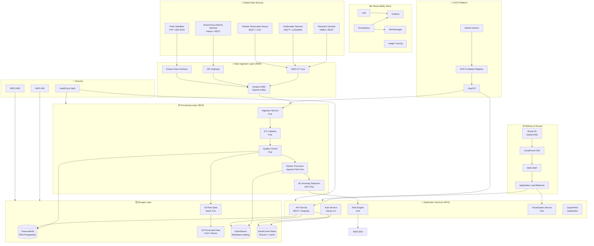

### Architecture Explanation

The DeepBlue system architecture follows a **layered, event-driven, cloud-native** design composed of six primary layers:

1. **Global Data Sources Layer:** Heterogeneous sensor networks and research instruments distributed worldwide communicate using standard protocols (MQTT for low-power IoT devices, REST for vessel APIs, FTP for bulk satellite transfers). The diversity of protocols requires a flexible ingestion gateway that abstracts source-specific communication from the processing pipeline.

2. **Data Ingestion Layer:** AWS IoT Core handles millions of concurrent MQTT device connections with managed TLS authentication and rule-based routing. Amazon MSK (Managed Kafka) serves as the central event backbone, providing durable, ordered, replayable streams for all incoming data. Kinesis Firehose handles high-throughput satellite data batches directly to S3.

3. **Processing Layer (EKS):** Containerized microservices consume Kafka topics, performing ETL transformations, quality control flagging, stream aggregation via Apache Flink, and ML-based anomaly detection on GPU-enabled pods. This layer scales horizontally based on Kafka consumer lag metrics.

4. **Storage Layer:** A polyglot persistence strategy serves different data access patterns — TimescaleDB for time-series queries, S3 tiered storage for bulk archival, OpenSearch for metadata and full-text catalog search, and ElastiCache Redis for API response caching and session management.

5. **Application Services Layer:** Stateless microservices expose RESTful and GraphQL APIs, handle OAuth 2.0 authentication, power JupyterHub for interactive research, and run the alert evaluation engine. All services are deployed on EKS with independent HPA configurations.

6. **Delivery Layer:** Route53 provides geo-based DNS routing. CloudFront delivers static portal assets globally. AWS WAF applies OWASP protection rules before traffic reaches the Application Load Balancer, which distributes requests across EKS pods.

---

## 6. Cloud Architecture Design (AWS)

### Region Strategy

DeepBlue employs a **Primary + Warm Standby** multi-region design:

| Role | AWS Region | Purpose |
|---|---|---|
| Primary | us-east-1 (N. Virginia) | Main production workloads, primary data store |
| Secondary | eu-west-1 (Ireland) | DR warm standby, GDPR data residency for European partners |
| Edge | ap-southeast-1 (Singapore) | Pacific/Indian Ocean sensor ingestion proximity |

### VPC Architecture

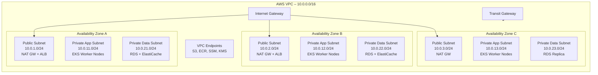

### AWS Services Matrix

| Service | Purpose | Tier |
|---|---|---|
| **Amazon EKS** | Kubernetes control plane + managed node groups | Compute |
| **EC2 (c6i, r6i, g4dn)** | EKS worker nodes (general, memory-optimized, GPU) | Compute |
| **AWS Fargate** | Serverless pods for bursty processing jobs | Compute |
| **Amazon MSK** | Managed Apache Kafka for event streaming | Messaging |
| **AWS IoT Core** | MQTT ingestion from 100K+ concurrent devices | IoT |
| **Amazon Kinesis Firehose** | Satellite batch data delivery to S3 | Streaming |
| **Amazon RDS (PostgreSQL + TimescaleDB)** | Time-series and relational data | Database |
| **Amazon OpenSearch** | Metadata catalog, log analytics | Search |
| **Amazon ElastiCache (Redis)** | API caching, session management | Cache |
| **Amazon S3** | Raw data lake, processed archive, Terraform state | Object Storage |
| **Amazon S3 Glacier** | Long-term scientific data archival (50+ years) | Archive |
| **AWS Lambda** | Event-driven alert dispatch, S3 event triggers | Serverless |
| **Amazon ECR** | Private container image registry | Registry |
| **Amazon CloudFront** | Global CDN for portal and static assets | CDN |
| **AWS Route 53** | Global DNS with health-check based failover | DNS |
| **Application Load Balancer** | L7 load balancing into EKS ingress | Load Balancing |
| **AWS WAF** | Web Application Firewall with OWASP rules | Security |
| **AWS IAM** | Identity and access management | Security |
| **AWS KMS** | Encryption key management | Security |
| **AWS Secrets Manager** | Managed secret storage with rotation | Security |
| **AWS Certificate Manager** | TLS certificate provisioning and renewal | Security |
| **Amazon CloudWatch** | Infrastructure metrics, alarms, log groups | Observability |
| **AWS CloudTrail** | API audit logging for compliance | Compliance |
| **AWS Config** | Resource configuration compliance tracking | Compliance |
| **AWS Backup** | Centralized backup orchestration | DR |
| **Amazon SNS** | Push notification delivery (alerts) | Notifications |
| **Amazon SES** | Transactional email for researcher notifications | Email |
| **AWS Cost Explorer + Budgets** | Cost monitoring and anomaly detection | FinOps |

---

## 7. Technology Stack Selection

### Core Platform

| Category | Technology | Version | Justification |
|---|---|---|---|
| **Cloud Provider** | Amazon Web Services | — | Broadest global infrastructure footprint; deepest Kubernetes integration via EKS; comprehensive managed service catalogue reducing operational overhead |
| **Container Orchestration** | Kubernetes (Amazon EKS) | 1.29 | Industry-standard for production-grade container orchestration; native horizontal scaling; rich ecosystem; managed control plane reduces ops burden |
| **Service Mesh** | Istio | 1.21 | Provides mTLS for all inter-service communication, advanced traffic management, circuit breaking, and distributed tracing injection without code changes |
| **GitOps Engine** | ArgoCD | 2.10 | Declarative, Git-driven continuous delivery with automatic drift detection and self-healing; native Kubernetes integration; clear audit trail |
| **Secret Management** | HashiCorp Vault | 1.16 | Dynamic secret generation, Kubernetes auth integration, PKI management, and audit logging exceeding what AWS Secrets Manager provides alone |

### Data & Messaging

| Category | Technology | Justification |
|---|---|---|
| **Event Streaming** | Apache Kafka (Amazon MSK) | Persistent, ordered, replayable message log; exactly-once semantics; enables decoupled microservice architecture; proven at 10M+ events/sec |
| **Time-Series Database** | TimescaleDB (on RDS PostgreSQL) | SQL-compatible time-series with automatic partitioning by time; hypertable compression up to 96%; mature ecosystem; no proprietary query language lock-in |
| **Stream Processing** | Apache Flink | True stateful streaming with event-time semantics, windowing, and watermarks; essential for correct multi-sensor correlation across network delays |
| **Search & Metadata** | OpenSearch (Amazon OpenSearch Service) | Full-text search and geo-spatial queries for the dataset catalog; managed service removes cluster administration burden |
| **Object Storage** | Amazon S3 + Glacier | Unlimited scalability; 11 nines durability; lifecycle policies for automated tiering; natively integrated with all AWS analytics services |
| **Cache** | Redis (ElastiCache) | Sub-millisecond latency for API response caching; Pub/Sub for real-time alert fan-out; cluster mode for high availability |

### Application & API

| Category | Technology | Justification |
|---|---|---|
| **Backend Framework** | Python FastAPI / Go | FastAPI for data science and ML integration workloads; Go for high-throughput ingestion services requiring low GC overhead |
| **API Gateway** | Amazon API Gateway + Kong | API Gateway for managed auth, rate limiting, and throttling; Kong for internal service-to-service routing |
| **Authentication** | Keycloak (OAuth 2.0 / OIDC) | Open-source identity provider with federated login (SAML for institutional SSO), RBAC, and Kubernetes OIDC integration |

### DevOps Toolchain

| Category | Technology | Justification |
|---|---|---|
| **IaC** | Terraform 1.8 | Declarative infrastructure definition; state management; multi-provider; extensive AWS provider; strong community modules |
| **Configuration Management** | Ansible 2.16 | Agentless; idempotent playbooks for node bootstrapping, OS hardening, and middleware configuration |
| **CI Platform** | GitHub Actions | Native to the code repository; matrix builds; large marketplace; OIDC integration with AWS eliminates long-lived credentials |
| **CD Platform** | Jenkins + ArgoCD | Jenkins for pre-deployment build/test orchestration; ArgoCD for Kubernetes continuous delivery via GitOps |
| **Container Build** | Docker + BuildKit | Industry standard; BuildKit provides parallel layer builds, secrets at build-time, and cross-platform image builds |
| **Image Registry** | Amazon ECR | Natively integrated with EKS; IAM-based access; vulnerability scanning via ECR Enhanced Scanning (Trivy) |
| **Helm** | Helm 3.14 | Kubernetes package manager for deploying complex application stacks with templating and version management |

### Observability

| Category | Technology | Justification |
|---|---|---|
| **Metrics** | Prometheus + Thanos | Prometheus for scrape-based metrics collection; Thanos for long-term metric storage, global query, and HA without data loss |
| **Visualization** | Grafana 10.x | Industry-standard dashboarding; multi-datasource (Prometheus, Loki, Tempo, OpenSearch); alerting; fine-grained RBAC |
| **Log Aggregation** | Grafana Loki | Lightweight log aggregation indexed by labels (not full-text); integrates natively with Grafana; cost-effective at scale |
| **Distributed Tracing** | Jaeger / Tempo | End-to-end request tracing across microservices for latency diagnosis; Istio auto-injects trace headers |
| **Log Analytics** | ELK Stack (Elasticsearch, Logstash, Kibana) | Full-text search across structured application logs; security event analysis; compliance reporting |
| **Alerting** | Alertmanager + PagerDuty | Alertmanager for deduplication, grouping, and routing; PagerDuty for on-call scheduling and escalation |

---

## 8. Infrastructure as Code Strategy

### 8.1 Terraform Architecture

The Terraform codebase uses a **modular monorepo structure** with remote state stored in S3 and state locking via DynamoDB. Workspaces map to environments (dev, staging, prod) while modules encapsulate reusable infrastructure components.

```
infrastructure/
├── terraform/
│   ├── environments/
│   │   ├── dev/
│   │   │   ├── main.tf
│   │   │   ├── variables.tf
│   │   │   └── terraform.tfvars
│   │   ├── staging/
│   │   └── prod/
│   ├── modules/
│   │   ├── vpc/
│   │   ├── eks/
│   │   ├── rds/
│   │   ├── msk/
│   │   ├── s3/
│   │   ├── iam/
│   │   ├── security-groups/
│   │   └── monitoring/
│   └── global/
│       ├── route53/
│       ├── cloudfront/
│       └── iam-global/
```

### Terraform State Management

```hcl
# backend.tf
terraform {
  backend "s3" {
    bucket         = "deepblue-terraform-state-prod"
    key            = "prod/terraform.tfstate"
    region         = "us-east-1"
    encrypt        = true
    kms_key_id     = "arn:aws:kms:us-east-1:ACCOUNT:key/KEY_ID"
    dynamodb_table = "deepblue-terraform-lock"
  }
  
  required_providers {
    aws = {
      source  = "hashicorp/aws"
      version = "~> 5.50"
    }
    kubernetes = {
      source  = "hashicorp/kubernetes"
      version = "~> 2.30"
    }
    helm = {
      source  = "hashicorp/helm"
      version = "~> 2.13"
    }
  }
  
  required_version = ">= 1.8.0"
}
```

### 8.2 Ansible Strategy

Ansible is used for **Day-2 operations**: OS-level hardening of EC2 nodes, JupyterHub configuration, Vault initialization, and database bootstrapping. Playbooks are executed from GitHub Actions after Terraform provisions infrastructure.

```
ansible/
├── inventory/
│   ├── aws_ec2.yml          # Dynamic EC2 inventory plugin
│   └── group_vars/
│       ├── all.yml
│       ├── eks_nodes.yml
│       └── bastion.yml
├── playbooks/
│   ├── site.yml             # Master playbook
│   ├── harden-os.yml        # CIS benchmark hardening
│   ├── install-monitoring-agents.yml
│   ├── configure-vault.yml
│   └── configure-jupyterhub.yml
├── roles/
│   ├── common/
│   ├── docker/
│   ├── node-exporter/
│   ├── filebeat/
│   └── vault-agent/
└── ansible.cfg
```

---

## 9. Containerization Strategy

### 9.1 Multi-Stage Dockerfile Design Principles

All DeepBlue container images follow these standards:
- **Multi-stage builds** to minimize final image size and attack surface
- **Non-root users** in all runtime stages
- **Pinned base image digests** for supply-chain security
- **COPY --chown** to avoid layer ownership issues
- **Health checks** embedded for Kubernetes readiness probes
- **Labels** for image metadata and traceability

### 9.2 Docker Compose for Local Development

Local development uses Docker Compose to mirror the production microservice topology. See `docker-compose.yml` in the supporting files.

---

## 10. Kubernetes Architecture

### 10.1 Namespace Strategy

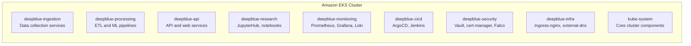

Each namespace carries:
- **LimitRange** to enforce default CPU/memory requests and limits
- **ResourceQuota** to cap total namespace resource consumption
- **NetworkPolicy** to enforce zero-trust inter-namespace communication (whitelist only)
- **PodDisruptionBudget** for stateful services

### 10.2 Node Group Architecture

| Node Group | Instance Type | Purpose | Min/Max |
|---|---|---|---|
| `system` | m6i.large | kube-system, monitoring, ArgoCD | 3/6 |
| `ingestion` | c6i.2xlarge | High-throughput Kafka consumers | 3/20 |
| `processing` | r6i.4xlarge | Memory-intensive ETL, Flink | 2/15 |
| `api` | c6i.xlarge | Stateless API pods | 3/30 |
| `gpu` | g4dn.xlarge | ML anomaly detection | 0/5 (scale-to-zero) |
| `research` | r6i.2xlarge | JupyterHub persistent kernels | 2/10 |

### 10.3 Horizontal Pod Autoscaler Configuration

HPA resources use both CPU-based and custom metrics (Kafka consumer lag via KEDA):

```yaml
# Ingestion service scaled on Kafka lag
apiVersion: keda.sh/v1alpha1
kind: ScaledObject
metadata:
  name: ingestion-service-scaler
  namespace: deepblue-ingestion
spec:
  scaleTargetRef:
    name: ingestion-service
  minReplicaCount: 3
  maxReplicaCount: 50
  triggers:
  - type: kafka
    metadata:
      bootstrapServers: msk.deepblue.internal:9092
      consumerGroup: ingestion-consumer-group
      topic: raw-sensor-data
      lagThreshold: "1000"
```

---

## 11. CI/CD Pipeline Design

### 11.1 Pipeline Overview

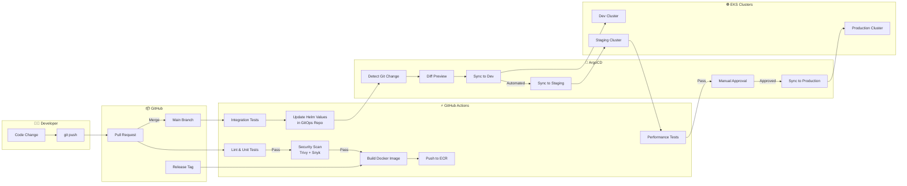

### 11.2 GitOps Repository Structure

The platform uses a **two-repository model**:
- `deepblue-app` — Application source code
- `deepblue-gitops` — Kubernetes manifests and Helm values (the source of truth for cluster state)

```
deepblue-gitops/
├── apps/
│   ├── ingestion/
│   │   ├── dev/
│   │   │   └── values.yaml
│   │   ├── staging/
│   │   │   └── values.yaml
│   │   └── prod/
│   │       └── values.yaml
│   ├── api/
│   ├── processing/
│   └── monitoring/
├── argocd/
│   ├── applications/
│   │   ├── ingestion-dev.yaml
│   │   ├── ingestion-staging.yaml
│   │   └── ingestion-prod.yaml
│   └── projects/
│       └── deepblue.yaml
└── cluster-config/
    ├── namespaces/
    ├── rbac/
    └── network-policies/
```

### 11.3 Jenkins Pipeline for Complex Builds

Jenkins is used for computationally intensive pipelines requiring multi-node parallel execution: long-running integration test suites, performance benchmarking, and release candidate validation. Jenkins is deployed within the `deepblue-cicd` namespace and configured via Jenkins Configuration as Code (JCasC).

---

## 12. Monitoring and Observability

### 12.1 Observability Architecture

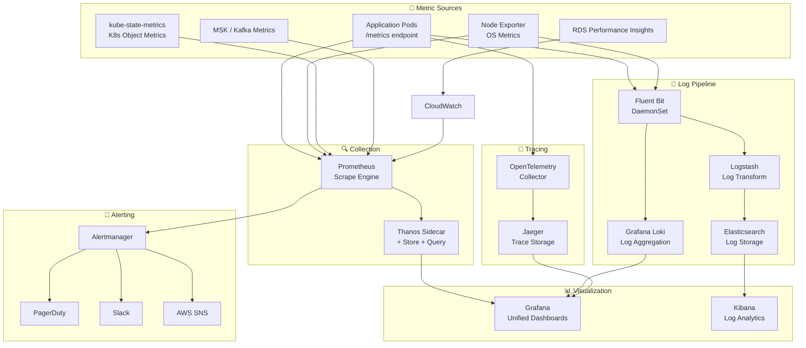

### 12.2 Key Prometheus Alert Rules

| Alert Name | Severity | Condition | Action |
|---|---|---|---|
| `IngestionLagHigh` | P1 | Kafka consumer lag > 100K messages for 5min | Page on-call SRE |
| `APILatencyHigh` | P1 | P99 API latency > 500ms for 2min | Page on-call SRE |
| `PodCrashLooping` | P2 | CrashLoopBackOff > 3 times in 15min | Alert Slack channel |
| `NodeDiskPressure` | P2 | Node disk usage > 85% | Alert Slack channel |
| `ETLPipelineStalled` | P1 | No ETL completions for 10min | Page on-call SRE |
| `CertExpiringSoon` | P3 | TLS cert expires in < 14 days | Ticket in Jira |
| `DatabaseConnectionsHigh` | P2 | RDS connections > 80% of max | Alert Slack channel |
| `GPUUtilizationLow` | P4 | GPU node idle > 30min | Auto-scale down |

---

## 13. Logging Architecture

### 13.1 Log Collection Pipeline

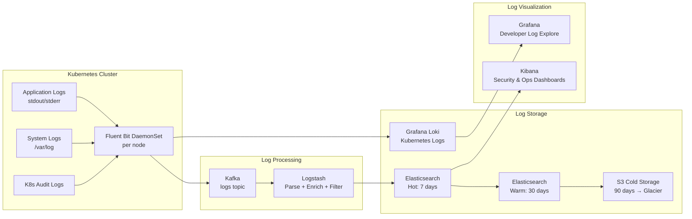

### 13.2 Log Schema Standard

All application logs must emit structured JSON conforming to the following schema:

```json
{
  "timestamp": "2026-06-18T11:30:00.123Z",
  "level": "INFO",
  "service": "ingestion-service",
  "version": "2.4.1",
  "trace_id": "4bf92f3577b34da6a3ce929d0e0e4736",
  "span_id": "00f067aa0ba902b7",
  "namespace": "deepblue-ingestion",
  "pod": "ingestion-service-7d4f8b9c6-xk2p9",
  "message": "Sensor batch processed",
  "sensor_id": "AUV-NORTH-PAC-042",
  "records_processed": 4800,
  "processing_duration_ms": 142,
  "quality_flags": ["QC_PASS"],
  "ocean_basin": "north_pacific"
}
```

### 13.3 Log Retention Policy

| Log Type | Hot (ES) | Warm (ES) | Cold (S3) | Archive (Glacier) |
|---|---|---|---|---|
| Application logs | 7 days | 30 days | 90 days | 1 year |
| Access logs | 7 days | 30 days | 1 year | 7 years |
| Security/Audit logs | 30 days | 90 days | 1 year | 7 years |
| Kubernetes events | 3 days | — | 30 days | — |
| Scientific pipeline logs | 30 days | 90 days | 5 years | 50 years |

---

## 14. Security Architecture

### 14.1 Defense-in-Depth Model

```mermaid
graph TB
    subgraph Internet["🌐 Internet"]
        USER[External User / Sensor]
    end

    subgraph Edge["Layer 1: Edge Security"]
        DDS[AWS Shield Advanced<br/>DDoS Protection]
        WAF2[AWS WAF<br/>OWASP Top 10 Rules]
        CF2[CloudFront<br/>TLS 1.3 Termination]
    end

    subgraph Network["Layer 2: Network Security"]
        R53H[Route53 Health Checks]
        ALB2[ALB<br/>HTTPS only, HSTS]
        SG[Security Groups<br/>Principle of Least Privilege]
        NACL[Network ACLs<br/>Subnet-level Firewall]
    end

    subgraph K8sLayer["Layer 3: Kubernetes Security"]
        RBAC_K[Kubernetes RBAC<br/>Namespace Isolation]
        NP[Network Policies<br/>Zero-Trust Pod Communication]
        PSA[Pod Security Admission<br/>Restricted Profile]
        FALCO[Falco<br/>Runtime Threat Detection]
    end

    subgraph AppLayer["Layer 4: Application Security"]
        OIDC[Keycloak OIDC<br/>MFA Enforced]
        JWT[JWT Validation<br/>at API Gateway]
        VAULT2[HashiCorp Vault<br/>Dynamic Secrets]
        KMS2[AWS KMS<br/>Envelope Encryption]
    end

    subgraph Data["Layer 5: Data Security"]
        ENC_REST[AES-256 Encryption<br/>at Rest - All Stores]
        ENC_TRANSIT[TLS 1.3 + mTLS<br/>in Transit]
        IMMUT[S3 Object Lock<br/>Immutable Audit Logs]
        DLP[AWS Macie<br/>PII/Sensitive Data Detection]
    end

    USER --> DDS --> WAF2 --> CF2
    CF2 --> R53H --> ALB2
    ALB2 --> SG --> NACL
    NACL --> RBAC_K --> NP --> PSA
    PSA --> FALCO
    FALCO --> OIDC --> JWT --> VAULT2 --> KMS2
    KMS2 --> ENC_REST
    ENC_REST --> ENC_TRANSIT
    ENC_TRANSIT --> IMMUT --> DLP
```

### 14.2 IAM Permission Boundaries

All IAM roles use **Permission Boundaries** to enforce a maximum permissions envelope. Service roles follow least-privilege and are provisioned via Terraform with mandatory tagging.

```
IAM Structure:
├── deepblue-eks-cluster-role          (EKS control plane)
├── deepblue-eks-node-role             (EC2 worker nodes)
├── deepblue-ingestion-service-role    (IRSA: MSK, IoT, S3 write)
├── deepblue-processing-service-role   (IRSA: S3 read/write, RDS)
├── deepblue-api-service-role          (IRSA: S3 read, ElastiCache)
├── deepblue-cicd-role                 (GitHub OIDC: ECR, EKS)
├── deepblue-terraform-role            (IaC provisioning)
└── deepblue-readonly-role             (Audit, compliance review)
```

### 14.3 Kubernetes RBAC Matrix

| Role | Permissions | Bound To |
|---|---|---|
| `platform-admin` | Full cluster access | Platform engineering team SA |
| `research-lead` | Read/write in assigned research namespace | Research lead users |
| `scientist` | Read pods/logs, exec in own namespace | Scientist users |
| `data-engineer` | Read/write processing namespace | Data engineering team |
| `cicd-deployer` | Create/update deployments, services | ArgoCD SA, Jenkins SA |
| `readonly-auditor` | Read-only all namespaces | Compliance/audit team |
| `monitoring` | Read pods, nodes, metrics | Prometheus SA |

### 14.4 Secret Management Workflow

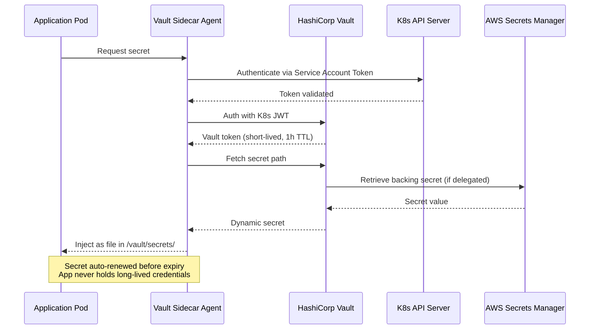

---

## 15. Disaster Recovery Plan

### 15.1 DR Architecture

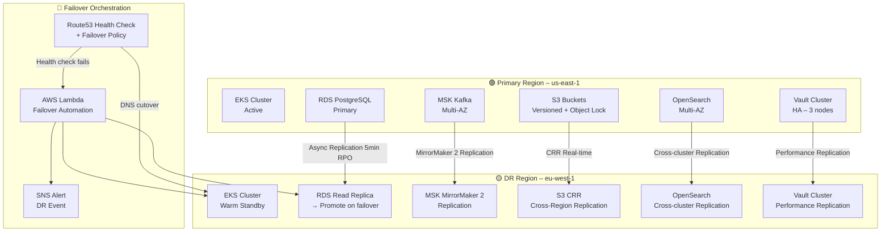

### 15.2 RTO/RPO Targets

| Service Tier | Services | RTO | RPO | DR Strategy |
|---|---|---|---|---|
| **Tier 0 – Critical** | Disaster alert engine, sensor ingestion | 5 min | 1 min | Active-Active multi-region |
| **Tier 1 – Essential** | API services, data processing | 15 min | 5 min | Warm standby in DR region |
| **Tier 2 – Important** | JupyterHub, batch processing | 1 hour | 15 min | Cold standby, manual promotion |
| **Tier 3 – Standard** | Development tools, CI/CD | 4 hours | 1 hour | Rebuild from IaC + backups |

### 15.3 Backup Strategy

| Data Store | Backup Method | Frequency | Retention | Cross-Region |
|---|---|---|---|---|
| RDS PostgreSQL | AWS Backup automated snapshots | Continuous (PITR) + Daily full | 35 days | Yes – copied to eu-west-1 |
| S3 Research Data | S3 CRR + S3 Object Lock (WORM) | Real-time replication | 50 years (Glacier Deep Archive) | Yes |
| OpenSearch | Manual snapshots to S3 | Every 6 hours | 30 days | Yes |
| Vault | Vault auto-unseal snapshot + AWS Backup | Hourly | 30 days | Yes |
| EKS Config | Velero snapshot (etcd + PVCs) | Every 4 hours | 14 days | Yes |
| ECR Images | Immutable image tags + replication | Per push | Indefinite (latest 100) | Yes |

### 15.4 Failover Runbook (Abbreviated)

1. **Detection (T+0):** Route53 health check fails for primary ALB for 3 consecutive 30-second intervals.
2. **Automated Trigger (T+1min):** CloudWatch alarm triggers Lambda failover function.
3. **DNS Cutover (T+2min):** Lambda updates Route53 record to point to DR region ALB.
4. **Database Promotion (T+3min):** Lambda promotes RDS read replica to standalone instance in eu-west-1.
5. **EKS Warm Start (T+5min):** Pre-scaled Karpenter node groups in DR cluster accept pod scheduling.
6. **Vault DR Activation (T+6min):** Vault DR replica promoted; applications authenticate against DR Vault.
7. **Kafka Cutover (T+8min):** MSK MirrorMaker 2 consumer groups re-pointed to DR MSK cluster.
8. **Verification (T+15min):** Automated smoke tests confirm API health, data ingestion, and alert engine functionality.
9. **Communication (T+15min):** Automated incident ticket created; stakeholders notified via PagerDuty and SNS.

---

## 16. Cost Optimization Strategy

### 16.1 Compute Cost Optimization

| Strategy | Mechanism | Expected Savings |
|---|---|---|
| **Spot Instances** | Processing and batch workloads on EC2 Spot via Karpenter; interruption handling with graceful job checkpointing | 60–70% vs On-Demand |
| **Savings Plans** | 1-year Compute Savings Plans for baseline EKS node groups (system, api) | 30–40% vs On-Demand |
| **Scale-to-Zero** | GPU node group scales to 0 when no ML jobs queued (Karpenter); Dev cluster scales down 18:00–06:00 | ~$2,400/month saved |
| **Right-sizing** | Monthly Compute Optimizer recommendations reviewed and applied | 15–25% efficiency gain |
| **Graviton3** | Migrate stateless services to AWS Graviton3 (c7g instances) | 20% better price/performance |

### 16.2 Storage Cost Optimization

| Strategy | Mechanism |
|---|---|
| **S3 Intelligent-Tiering** | Raw sensor data auto-tiered based on access patterns |
| **S3 Lifecycle Policies** | 30-day: Standard → Standard-IA; 90-day: → Glacier Instant; 1-year: → Glacier Deep Archive |
| **EBS gp3 Migration** | All gp2 volumes converted to gp3 (20% lower cost, configurable IOPS) |
| **TimescaleDB Compression** | Enable native hypertable compression achieving 85–96% size reduction on data older than 30 days |
| **Log Retention Tuning** | Implement tiered log storage to avoid over-retention in expensive Elasticsearch hot storage |

### 16.3 Cost Governance

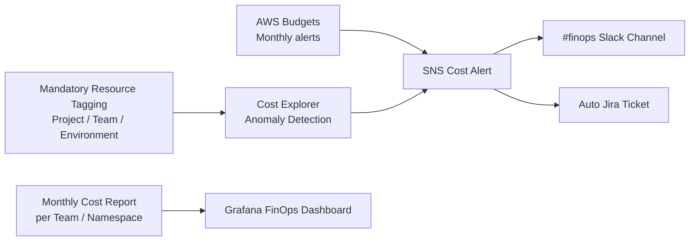

**Mandatory Tags on all resources:**
- `Project: deepblue`
- `Environment: prod|staging|dev`
- `Team: platform|data-eng|research`
- `CostCenter: CC-XXXX`
- `ManagedBy: terraform`

---

## 17. DevOps Workflow Diagram

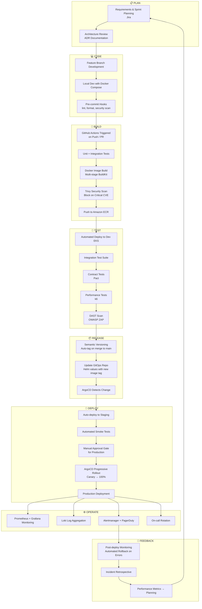

The DevOps workflow implements the complete **Plan → Code → Build → Test → Release → Deploy → Operate → Monitor** cycle (the infinite DevOps loop). Every stage is automated where possible, with human approval gates only at the production deployment boundary. Feedback loops ensure that production telemetry drives future sprint planning, creating a continuously improving system.

---

## 18. Deployment Architecture Diagram

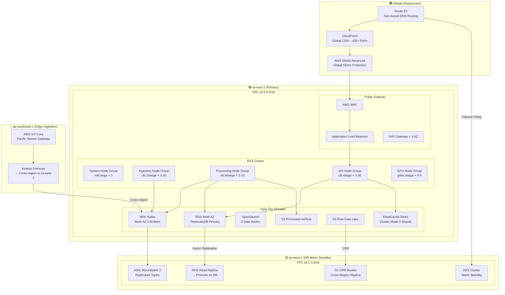

---

## 19. Kubernetes YAML Examples

Detailed Kubernetes manifests are provided in the `kubernetes/` directory. Below are the key configuration summaries.

### Namespace with ResourceQuota and LimitRange

```yaml
# kubernetes/namespaces/deepblue-ingestion.yaml
apiVersion: v1
kind: Namespace
metadata:
  name: deepblue-ingestion
  labels:
    project: deepblue
    team: data-engineering
    environment: production
    pod-security.kubernetes.io/enforce: restricted
    pod-security.kubernetes.io/audit: restricted
    pod-security.kubernetes.io/warn: restricted
---
apiVersion: v1
kind: ResourceQuota
metadata:
  name: ingestion-quota
  namespace: deepblue-ingestion
spec:
  hard:
    requests.cpu: "40"
    requests.memory: 80Gi
    limits.cpu: "80"
    limits.memory: 160Gi
    pods: "200"
    services: "20"
    persistentvolumeclaims: "50"
---
apiVersion: v1
kind: LimitRange
metadata:
  name: ingestion-limits
  namespace: deepblue-ingestion
spec:
  limits:
  - type: Container
    default:
      cpu: 500m
      memory: 512Mi
    defaultRequest:
      cpu: 100m
      memory: 128Mi
    max:
      cpu: "8"
      memory: 16Gi
    min:
      cpu: 50m
      memory: 64Mi
```

### Ingestion Service Deployment

```yaml
# kubernetes/deployments/ingestion-service.yaml
apiVersion: apps/v1
kind: Deployment
metadata:
  name: ingestion-service
  namespace: deepblue-ingestion
  labels:
    app: ingestion-service
    version: "2.4.1"
    component: ingestion
spec:
  replicas: 5
  revisionHistoryLimit: 5
  selector:
    matchLabels:
      app: ingestion-service
  strategy:
    type: RollingUpdate
    rollingUpdate:
      maxSurge: 2
      maxUnavailable: 0
  template:
    metadata:
      labels:
        app: ingestion-service
        version: "2.4.1"
      annotations:
        prometheus.io/scrape: "true"
        prometheus.io/port: "8080"
        prometheus.io/path: "/metrics"
        sidecar.istio.io/inject: "true"
    spec:
      serviceAccountName: ingestion-service-sa
      securityContext:
        runAsNonRoot: true
        runAsUser: 1000
        fsGroup: 1000
        seccompProfile:
          type: RuntimeDefault
      affinity:
        podAntiAffinity:
          requiredDuringSchedulingIgnoredDuringExecution:
          - labelSelector:
              matchLabels:
                app: ingestion-service
            topologyKey: kubernetes.io/hostname
        nodeAffinity:
          requiredDuringSchedulingIgnoredDuringExecution:
            nodeSelectorTerms:
            - matchExpressions:
              - key: node-group
                operator: In
                values: ["ingestion"]
      containers:
      - name: ingestion-service
        image: 123456789.dkr.ecr.us-east-1.amazonaws.com/deepblue/ingestion-service:2.4.1
        imagePullPolicy: Always
        ports:
        - containerPort: 8080
          name: http
        - containerPort: 9090
          name: metrics
        env:
        - name: KAFKA_BROKERS
          valueFrom:
            configMapKeyRef:
              name: ingestion-config
              key: kafka_brokers
        - name: DB_PASSWORD
          valueFrom:
            secretKeyRef:
              name: ingestion-db-secret
              key: password
        - name: POD_NAME
          valueFrom:
            fieldRef:
              fieldPath: metadata.name
        - name: NAMESPACE
          valueFrom:
            fieldRef:
              fieldPath: metadata.namespace
        resources:
          requests:
            cpu: 500m
            memory: 512Mi
          limits:
            cpu: "2"
            memory: 2Gi
        readinessProbe:
          httpGet:
            path: /health/ready
            port: 8080
          initialDelaySeconds: 15
          periodSeconds: 10
          failureThreshold: 3
        livenessProbe:
          httpGet:
            path: /health/live
            port: 8080
          initialDelaySeconds: 30
          periodSeconds: 20
          failureThreshold: 3
        securityContext:
          allowPrivilegeEscalation: false
          readOnlyRootFilesystem: true
          capabilities:
            drop: ["ALL"]
        volumeMounts:
        - name: tmp
          mountPath: /tmp
        - name: vault-secrets
          mountPath: /vault/secrets
          readOnly: true
      volumes:
      - name: tmp
        emptyDir: {}
      - name: vault-secrets
        emptyDir:
          medium: Memory
      terminationGracePeriodSeconds: 60
      topologySpreadConstraints:
      - maxSkew: 1
        topologyKey: topology.kubernetes.io/zone
        whenUnsatisfiable: DoNotSchedule
        labelSelector:
          matchLabels:
            app: ingestion-service
```

### Horizontal Pod Autoscaler (CPU + Custom Metric)

```yaml
# kubernetes/hpa/ingestion-hpa.yaml
apiVersion: autoscaling/v2
kind: HorizontalPodAutoscaler
metadata:
  name: ingestion-service-hpa
  namespace: deepblue-ingestion
spec:
  scaleTargetRef:
    apiVersion: apps/v1
    kind: Deployment
    name: ingestion-service
  minReplicas: 5
  maxReplicas: 50
  metrics:
  - type: Resource
    resource:
      name: cpu
      target:
        type: Utilization
        averageUtilization: 60
  - type: Resource
    resource:
      name: memory
      target:
        type: Utilization
        averageUtilization: 70
  - type: External
    external:
      metric:
        name: kafka_consumer_lag_sum
        selector:
          matchLabels:
            topic: raw-sensor-data
            consumer_group: ingestion-consumer-group
      target:
        type: AverageValue
        averageValue: "500"
  behavior:
    scaleUp:
      stabilizationWindowSeconds: 60
      policies:
      - type: Pods
        value: 5
        periodSeconds: 60
    scaleDown:
      stabilizationWindowSeconds: 300
      policies:
      - type: Pods
        value: 2
        periodSeconds: 120
```

### Network Policy (Zero-Trust)

```yaml
# kubernetes/network-policies/ingestion-netpol.yaml
apiVersion: networking.k8s.io/v1
kind: NetworkPolicy
metadata:
  name: ingestion-network-policy
  namespace: deepblue-ingestion
spec:
  podSelector:
    matchLabels:
      app: ingestion-service
  policyTypes:
  - Ingress
  - Egress
  ingress:
  - from:
    - namespaceSelector:
        matchLabels:
          kubernetes.io/metadata.name: deepblue-infra
      podSelector:
        matchLabels:
          app: ingress-nginx
    ports:
    - protocol: TCP
      port: 8080
  - from:
    - namespaceSelector:
        matchLabels:
          kubernetes.io/metadata.name: deepblue-monitoring
      podSelector:
        matchLabels:
          app: prometheus
    ports:
    - protocol: TCP
      port: 9090
  egress:
  - to:
    - namespaceSelector:
        matchLabels:
          kubernetes.io/metadata.name: deepblue-processing
    ports:
    - protocol: TCP
      port: 8080
  - ports:
    - protocol: TCP
      port: 9092
    - protocol: TCP
      port: 443
    - protocol: TCP
      port: 53
    - protocol: UDP
      port: 53
```

### Ingress with TLS

```yaml
# kubernetes/ingress/api-ingress.yaml
apiVersion: networking.k8s.io/v1
kind: Ingress
metadata:
  name: deepblue-api-ingress
  namespace: deepblue-api
  annotations:
    kubernetes.io/ingress.class: nginx
    nginx.ingress.kubernetes.io/ssl-redirect: "true"
    nginx.ingress.kubernetes.io/force-ssl-redirect: "true"
    nginx.ingress.kubernetes.io/rate-limit: "100"
    nginx.ingress.kubernetes.io/rate-limit-window: "1m"
    cert-manager.io/cluster-issuer: letsencrypt-prod
    nginx.ingress.kubernetes.io/proxy-body-size: "100m"
    nginx.ingress.kubernetes.io/enable-cors: "true"
    nginx.ingress.kubernetes.io/cors-allow-origin: "https://portal.deepblue.org"
spec:
  tls:
  - hosts:
    - api.deepblue.org
    secretName: deepblue-api-tls
  rules:
  - host: api.deepblue.org
    http:
      paths:
      - path: /v1
        pathType: Prefix
        backend:
          service:
            name: api-service
            port:
              number: 8080
      - path: /graphql
        pathType: Exact
        backend:
          service:
            name: graphql-service
            port:
              number: 4000
```

### ConfigMap and Secret

```yaml
# kubernetes/configs/ingestion-configmap.yaml
apiVersion: v1
kind: ConfigMap
metadata:
  name: ingestion-config
  namespace: deepblue-ingestion
  labels:
    app: ingestion-service
data:
  kafka_brokers: "msk-broker-1.deepblue.internal:9092,msk-broker-2.deepblue.internal:9092,msk-broker-3.deepblue.internal:9092"
  kafka_topic_raw: "raw-sensor-data"
  kafka_topic_qc: "qc-sensor-data"
  kafka_consumer_group: "ingestion-consumer-group"
  batch_size: "1000"
  processing_timeout_ms: "5000"
  qc_threshold_temp_min: "-2.5"
  qc_threshold_temp_max: "35.0"
  log_level: "INFO"
  metrics_port: "9090"
  ocean_basins: "north_atlantic,south_atlantic,north_pacific,south_pacific,indian,arctic,southern"
---
# kubernetes/configs/ingestion-secret.yaml
# NOTE: In production, this is managed by External Secrets Operator + Vault
apiVersion: external-secrets.io/v1beta1
kind: ExternalSecret
metadata:
  name: ingestion-db-secret
  namespace: deepblue-ingestion
spec:
  refreshInterval: 1h
  secretStoreRef:
    name: vault-backend
    kind: ClusterSecretStore
  target:
    name: ingestion-db-secret
    creationPolicy: Owner
  data:
  - secretKey: password
    remoteRef:
      key: deepblue/ingestion/db
      property: password
  - secretKey: username
    remoteRef:
      key: deepblue/ingestion/db
      property: username
```

---

## 20. Terraform Sample Code

Complete Terraform code is provided in the `terraform/` directory. Key excerpts:

### VPC Module

```hcl
# terraform/modules/vpc/main.tf
module "vpc" {
  source  = "terraform-aws-modules/vpc/aws"
  version = "~> 5.8"

  name = "${var.project_name}-${var.environment}-vpc"
  cidr = var.vpc_cidr

  azs              = data.aws_availability_zones.available.names
  public_subnets   = var.public_subnet_cidrs
  private_subnets  = var.private_subnet_cidrs
  database_subnets = var.database_subnet_cidrs

  enable_nat_gateway     = true
  single_nat_gateway     = var.environment == "dev" ? true : false
  one_nat_gateway_per_az = var.environment == "prod" ? true : false

  enable_dns_hostnames = true
  enable_dns_support   = true

  enable_flow_log                      = true
  create_flow_log_cloudwatch_iam_role  = true
  create_flow_log_cloudwatch_log_group = true
  flow_log_retention_in_days           = 90

  public_subnet_tags = {
    "kubernetes.io/role/elb"                          = "1"
    "kubernetes.io/cluster/${local.cluster_name}"     = "owned"
  }
  private_subnet_tags = {
    "kubernetes.io/role/internal-elb"                 = "1"
    "kubernetes.io/cluster/${local.cluster_name}"     = "owned"
    "karpenter.sh/discovery"                          = local.cluster_name
  }

  tags = local.common_tags
}
```

### EKS Module

```hcl
# terraform/modules/eks/main.tf
module "eks" {
  source  = "terraform-aws-modules/eks/aws"
  version = "~> 20.8"

  cluster_name    = local.cluster_name
  cluster_version = var.kubernetes_version

  cluster_endpoint_public_access       = false
  cluster_endpoint_private_access      = true
  cluster_endpoint_public_access_cidrs = var.management_cidrs

  vpc_id     = module.vpc.vpc_id
  subnet_ids = module.vpc.private_subnets

  cluster_addons = {
    coredns = {
      most_recent = true
    }
    kube-proxy = {
      most_recent = true
    }
    vpc-cni = {
      most_recent              = true
      service_account_role_arn = module.vpc_cni_irsa.iam_role_arn
    }
    aws-ebs-csi-driver = {
      most_recent              = true
      service_account_role_arn = module.ebs_csi_irsa.iam_role_arn
    }
    aws-efs-csi-driver = {
      most_recent              = true
      service_account_role_arn = module.efs_csi_irsa.iam_role_arn
    }
  }

  eks_managed_node_groups = {
    system = {
      name           = "system"
      instance_types = ["m6i.large", "m6a.large"]
      capacity_type  = "ON_DEMAND"
      min_size       = 3
      max_size       = 6
      desired_size   = 3
      labels = {
        "node-group" = "system"
      }
      taints = [{
        key    = "CriticalAddonsOnly"
        value  = "true"
        effect = "NO_SCHEDULE"
      }]
    }

    ingestion = {
      name           = "ingestion"
      instance_types = ["c6i.2xlarge", "c6a.2xlarge", "c7i.2xlarge"]
      capacity_type  = "SPOT"
      min_size       = 3
      max_size       = 20
      desired_size   = 3
      labels = {
        "node-group" = "ingestion"
      }
      block_device_mappings = {
        xvda = {
          device_name = "/dev/xvda"
          ebs = {
            volume_size           = 100
            volume_type           = "gp3"
            iops                  = 3000
            throughput            = 125
            encrypted             = true
            kms_key_id            = module.kms.key_arn
            delete_on_termination = true
          }
        }
      }
    }

    processing = {
      name           = "processing"
      instance_types = ["r6i.4xlarge", "r6a.4xlarge"]
      capacity_type  = "SPOT"
      min_size       = 2
      max_size       = 15
      desired_size   = 3
      labels = {
        "node-group" = "processing"
      }
    }

    api = {
      name           = "api"
      instance_types = ["c6i.xlarge", "c6a.xlarge", "c7i.xlarge"]
      capacity_type  = "ON_DEMAND"
      min_size       = 3
      max_size       = 30
      desired_size   = 5
      labels = {
        "node-group" = "api"
      }
    }

    gpu = {
      name           = "gpu"
      instance_types = ["g4dn.xlarge"]
      capacity_type  = "SPOT"
      min_size       = 0
      max_size       = 5
      desired_size   = 0
      ami_type       = "AL2_x86_64_GPU"
      labels = {
        "node-group"                  = "gpu"
        "nvidia.com/gpu.present"      = "true"
      }
      taints = [{
        key    = "nvidia.com/gpu"
        value  = "true"
        effect = "NO_SCHEDULE"
      }]
    }
  }

  cluster_security_group_additional_rules = {
    ingress_nodes_ephemeral = {
      description                = "Node to cluster API"
      protocol                   = "tcp"
      from_port                  = 443
      to_port                    = 443
      type                       = "ingress"
      source_node_security_group = true
    }
  }

  manage_aws_auth_configmap = true
  aws_auth_roles = [
    {
      rolearn  = module.karpenter.role_arn
      username = "system:node:{{EC2PrivateDNSName}}"
      groups   = ["system:bootstrappers", "system:nodes"]
    },
    {
      rolearn  = "arn:aws:iam::${data.aws_caller_identity.current.account_id}:role/deepblue-cicd-role"
      username = "deepblue-cicd"
      groups   = ["deepblue-deployers"]
    }
  ]

  tags = merge(local.common_tags, {
    "karpenter.sh/discovery" = local.cluster_name
  })
}
```

### RDS TimescaleDB Module

```hcl
# terraform/modules/rds/main.tf
module "rds" {
  source  = "terraform-aws-modules/rds/aws"
  version = "~> 6.6"

  identifier = "${var.project_name}-${var.environment}-tsdb"

  engine               = "postgres"
  engine_version       = "15.6"
  family               = "postgres15"
  major_engine_version = "15"
  instance_class       = var.rds_instance_class

  allocated_storage     = 500
  max_allocated_storage = 5000
  storage_type          = "gp3"
  storage_encrypted     = true
  kms_key_id            = module.rds_kms.key_arn

  db_name  = "deepblue"
  username = "deepblue_admin"
  port     = 5432

  manage_master_user_password                            = true
  manage_master_user_password_rotation                   = true
  master_user_password_rotation_automatically_after_days = 30

  multi_az               = true
  db_subnet_group_name   = module.vpc.database_subnet_group
  vpc_security_group_ids = [module.rds_sg.security_group_id]

  maintenance_window              = "Mon:00:00-Mon:03:00"
  backup_window                   = "03:00-06:00"
  enabled_cloudwatch_logs_exports = ["postgresql", "upgrade"]
  create_cloudwatch_log_group     = true

  backup_retention_period = 35
  skip_final_snapshot     = false
  deletion_protection     = true

  performance_insights_enabled          = true
  performance_insights_retention_period = 31
  performance_insights_kms_key_id       = module.rds_kms.key_arn

  monitoring_interval    = 60
  monitoring_role_name   = "${var.project_name}-rds-monitoring-role"
  create_monitoring_role = true

  parameters = [
    {
      name  = "shared_preload_libraries"
      value = "timescaledb,pg_stat_statements"
    },
    {
      name  = "max_connections"
      value = "500"
    },
    {
      name  = "work_mem"
      value = "65536"
    },
    {
      name  = "timescaledb.max_background_workers"
      value = "16"
    }
  ]

  tags = local.common_tags
}
```

---

## 21. GitHub Actions CI/CD Pipeline

The complete pipeline is in `.github/workflows/`. Below are the key workflow files.

### Main CI Pipeline (ci.yml)

```yaml
# .github/workflows/ci.yml
name: DeepBlue CI Pipeline

on:
  push:
    branches: [main, develop, "release/**"]
  pull_request:
    branches: [main, develop]

env:
  AWS_REGION: us-east-1
  ECR_REGISTRY: ${{ secrets.AWS_ACCOUNT_ID }}.dkr.ecr.us-east-1.amazonaws.com
  IMAGE_NAME: deepblue/ingestion-service

permissions:
  id-token: write
  contents: read
  security-events: write
  pull-requests: write

jobs:
  lint-and-test:
    name: Lint & Unit Tests
    runs-on: ubuntu-latest
    strategy:
      matrix:
        service: [ingestion-service, processing-service, api-service, alert-engine]
    steps:
    - name: Checkout
      uses: actions/checkout@v4

    - name: Set up Python
      uses: actions/setup-python@v5
      with:
        python-version: "3.12"
        cache: pip

    - name: Install dependencies
      run: |
        cd services/${{ matrix.service }}
        pip install -r requirements.txt -r requirements-dev.txt

    - name: Lint with Ruff
      run: |
        cd services/${{ matrix.service }}
        ruff check . --output-format=github

    - name: Type check with mypy
      run: |
        cd services/${{ matrix.service }}
        mypy . --ignore-missing-imports

    - name: Run unit tests with coverage
      run: |
        cd services/${{ matrix.service }}
        pytest tests/unit/ -v \
          --cov=. \
          --cov-report=xml:coverage.xml \
          --cov-fail-under=80 \
          --junit-xml=test-results.xml

    - name: Upload coverage to Codecov
      uses: codecov/codecov-action@v4
      with:
        file: services/${{ matrix.service }}/coverage.xml
        flags: ${{ matrix.service }}

    - name: Publish test results
      uses: EnricoMi/publish-unit-test-result-action@v2
      if: always()
      with:
        files: services/${{ matrix.service }}/test-results.xml

  security-scan:
    name: Security Scanning
    runs-on: ubuntu-latest
    needs: lint-and-test
    steps:
    - name: Checkout
      uses: actions/checkout@v4

    - name: Run Trivy vulnerability scanner (filesystem)
      uses: aquasecurity/trivy-action@master
      with:
        scan-type: fs
        scan-ref: .
        format: sarif
        output: trivy-fs-results.sarif
        severity: CRITICAL,HIGH
        exit-code: 1

    - name: Upload Trivy filesystem scan results to GitHub Security tab
      uses: github/codeql-action/upload-sarif@v3
      if: always()
      with:
        sarif_file: trivy-fs-results.sarif

    - name: Run Snyk to check for vulnerabilities
      uses: snyk/actions/python@master
      with:
        args: --severity-threshold=high --all-projects
      env:
        SNYK_TOKEN: ${{ secrets.SNYK_TOKEN }}

    - name: Checkov IaC scan
      uses: bridgecrewio/checkov-action@master
      with:
        directory: terraform/
        framework: terraform
        output_format: sarif
        output_file_path: checkov-results.sarif

    - name: Upload Checkov results
      uses: github/codeql-action/upload-sarif@v3
      if: always()
      with:
        sarif_file: checkov-results.sarif

  build-and-push:
    name: Build & Push Container Images
    runs-on: ubuntu-latest
    needs: security-scan
    if: github.event_name == 'push'
    strategy:
      matrix:
        service: [ingestion-service, processing-service, api-service, alert-engine]
    outputs:
      image_tag: ${{ steps.meta.outputs.tags }}
      image_digest: ${{ steps.build.outputs.digest }}
    steps:
    - name: Checkout
      uses: actions/checkout@v4

    - name: Configure AWS credentials (OIDC)
      uses: aws-actions/configure-aws-credentials@v4
      with:
        role-to-assume: arn:aws:iam::${{ secrets.AWS_ACCOUNT_ID }}:role/deepblue-cicd-role
        role-session-name: GitHubActionsDeploySession
        aws-region: ${{ env.AWS_REGION }}

    - name: Login to Amazon ECR
      id: ecr-login
      uses: aws-actions/amazon-ecr-login@v2

    - name: Extract Docker metadata
      id: meta
      uses: docker/metadata-action@v5
      with:
        images: ${{ env.ECR_REGISTRY }}/deepblue/${{ matrix.service }}
        tags: |
          type=ref,event=branch
          type=ref,event=pr
          type=semver,pattern={{version}}
          type=semver,pattern={{major}}.{{minor}}
          type=sha,prefix=sha-,format=short
          type=raw,value=latest,enable=${{ github.ref == 'refs/heads/main' }}

    - name: Set up Docker Buildx
      uses: docker/setup-buildx-action@v3

    - name: Build and push Docker image
      id: build
      uses: docker/build-push-action@v5
      with:
        context: services/${{ matrix.service }}
        file: services/${{ matrix.service }}/Dockerfile
        push: true
        tags: ${{ steps.meta.outputs.tags }}
        labels: ${{ steps.meta.outputs.labels }}
        cache-from: type=gha
        cache-to: type=gha,mode=max
        platforms: linux/amd64,linux/arm64
        sbom: true
        provenance: true

    - name: Run Trivy image scan
      uses: aquasecurity/trivy-action@master
      with:
        image-ref: ${{ env.ECR_REGISTRY }}/deepblue/${{ matrix.service }}:sha-${{ github.sha }}
        format: sarif
        output: trivy-image-${{ matrix.service }}.sarif
        severity: CRITICAL
        exit-code: 1

    - name: Sign container image with cosign
      uses: sigstore/cosign-installer@v3
      
    - name: Sign the published Docker image
      run: |
        cosign sign --yes \
          ${{ env.ECR_REGISTRY }}/deepblue/${{ matrix.service }}@${{ steps.build.outputs.digest }}
      env:
        COSIGN_EXPERIMENTAL: 1

  update-gitops:
    name: Update GitOps Repository
    runs-on: ubuntu-latest
    needs: build-and-push
    if: github.ref == 'refs/heads/main'
    steps:
    - name: Checkout GitOps repo
      uses: actions/checkout@v4
      with:
        repository: deepblue-research/deepblue-gitops
        token: ${{ secrets.GITOPS_TOKEN }}
        path: gitops

    - name: Update image tags in Helm values
      run: |
        cd gitops
        SHORT_SHA=$(echo "${{ github.sha }}" | cut -c1-7)
        
        for service in ingestion-service processing-service api-service alert-engine; do
          yq eval ".image.tag = \"sha-${SHORT_SHA}\"" \
            -i apps/${service}/staging/values.yaml
        done

    - name: Commit and push changes
      run: |
        cd gitops
        git config user.email "cicd-bot@deepblue.org"
        git config user.name "DeepBlue CI Bot"
        git add .
        git commit -m "chore: update image tags to sha-$(echo '${{ github.sha }}' | cut -c1-7) [skip ci]"
        git push

  integration-tests:
    name: Integration Tests (Dev Cluster)
    runs-on: ubuntu-latest
    needs: update-gitops
    environment: dev
    steps:
    - name: Checkout
      uses: actions/checkout@v4

    - name: Configure AWS credentials
      uses: aws-actions/configure-aws-credentials@v4
      with:
        role-to-assume: arn:aws:iam::${{ secrets.AWS_ACCOUNT_ID }}:role/deepblue-cicd-role
        aws-region: ${{ env.AWS_REGION }}

    - name: Update kubeconfig for dev cluster
      run: |
        aws eks update-kubeconfig \
          --region ${{ env.AWS_REGION }} \
          --name deepblue-dev-eks

    - name: Wait for ArgoCD sync to complete
      run: |
        kubectl wait --for=condition=Synced application/deepblue-ingestion-dev \
          -n deepblue-cicd --timeout=300s
        kubectl wait --for=condition=Healthy application/deepblue-api-dev \
          -n deepblue-cicd --timeout=300s

    - name: Run integration tests
      run: |
        cd tests/integration
        pip install -r requirements.txt
        pytest . -v \
          --base-url=https://api.dev.deepblue.org \
          --junit-xml=integration-results.xml \
          --timeout=60
      env:
        API_KEY: ${{ secrets.DEV_API_KEY }}

    - name: Run k6 performance tests
      uses: grafana/k6-action@v0.3.1
      with:
        filename: tests/performance/api-load-test.js
        flags: --env BASE_URL=https://api.dev.deepblue.org
```

### Production Deployment Workflow

```yaml
# .github/workflows/deploy-production.yml
name: Production Deployment

on:
  workflow_dispatch:
    inputs:
      version:
        description: 'Release version to deploy (e.g., v2.4.1)'
        required: true
        type: string
      dry_run:
        description: 'Dry run (show diff without applying)'
        required: false
        type: boolean
        default: false

jobs:
  pre-deployment-checks:
    name: Pre-Deployment Validation
    runs-on: ubuntu-latest
    environment: production
    steps:
    - name: Validate version format
      run: |
        if ! echo "${{ inputs.version }}" | grep -qE '^v[0-9]+\.[0-9]+\.[0-9]+$'; then
          echo "Invalid version format. Expected: vX.Y.Z"
          exit 1
        fi

    - name: Check staging health
      run: |
        STAGING_HEALTH=$(curl -sf https://api.staging.deepblue.org/health | jq -r '.status')
        if [ "$STAGING_HEALTH" != "healthy" ]; then
          echo "Staging is not healthy. Blocking production deployment."
          exit 1
        fi

  deploy-production:
    name: Deploy to Production
    runs-on: ubuntu-latest
    needs: pre-deployment-checks
    environment:
      name: production
      url: https://api.deepblue.org
    steps:
    - name: Checkout GitOps repo
      uses: actions/checkout@v4
      with:
        repository: deepblue-research/deepblue-gitops
        token: ${{ secrets.GITOPS_TOKEN }}

    - name: Update production Helm values
      if: ${{ !inputs.dry_run }}
      run: |
        VERSION=${{ inputs.version }}
        for service in ingestion-service processing-service api-service alert-engine; do
          yq eval ".image.tag = \"${VERSION}\"" \
            -i apps/${service}/prod/values.yaml
        done

    - name: Create ArgoCD sync
      if: ${{ !inputs.dry_run }}
      run: |
        git config user.email "cicd-bot@deepblue.org"
        git config user.name "DeepBlue Release Bot"
        git add .
        git commit -m "release: deploy ${{ inputs.version }} to production"
        git push

    - name: Wait for production sync
      if: ${{ !inputs.dry_run }}
      run: |
        # ArgoCD will auto-sync from the GitOps repo change
        sleep 30
        kubectl wait --for=condition=Healthy application/deepblue-api-prod \
          -n deepblue-cicd --timeout=600s

    - name: Post-deployment smoke tests
      run: |
        cd tests/smoke
        pip install requests
        python run_smoke_tests.py \
          --env production \
          --base-url https://api.deepblue.org

    - name: Create GitHub Release
      if: ${{ !inputs.dry_run }}
      uses: actions/create-release@v1
      with:
        tag_name: ${{ inputs.version }}
        release_name: DeepBlue Platform ${{ inputs.version }}
        draft: false
        prerelease: false
      env:
        GITHUB_TOKEN: ${{ secrets.GITHUB_TOKEN }}
```

---

## 22. Monitoring Dashboard Design

### 22.1 Grafana Dashboard Hierarchy

```
Grafana Dashboards/
├── 1. Executive Overview
│   ├── Platform Uptime (30-day SLA)
│   ├── Total Sensors Online
│   ├── Data Ingestion Rate (TB/day)
│   ├── Active Research Projects
│   └── Cost by Team (AWS Cost Explorer datasource)
│
├── 2. Infrastructure Health
│   ├── EKS Node CPU/Memory/Disk (per node group)
│   ├── Pod Status (Running/Pending/Failed by namespace)
│   ├── Network I/O (cluster-level)
│   └── PersistentVolume usage
│
├── 3. Data Ingestion Pipeline
│   ├── Messages/sec per Kafka topic
│   ├── Kafka Consumer Lag (per consumer group)
│   ├── Ingestion Service Throughput and Latency
│   ├── QC Pass/Fail Rate by Sensor Type
│   └── Active MQTT Connections (IoT Core)
│
├── 4. API Performance (RED Dashboard)
│   ├── Request Rate (RPS per endpoint)
│   ├── Error Rate (5xx, 4xx per endpoint)
│   ├── Duration P50/P95/P99 per endpoint
│   └── Active Sessions by Region
│
├── 5. Database Performance
│   ├── RDS CPU/Memory/Connections
│   ├── Query Latency (P50, P95, P99)
│   ├── Hypertable Row Counts (TimescaleDB)
│   ├── Disk IOPS and Throughput
│   └── Replication Lag (replica delay seconds)
│
├── 6. Security & Compliance
│   ├── Failed Login Attempts (Keycloak)
│   ├── Falco Alert Rate by Rule Category
│   ├── TLS Certificate Expiry Status
│   ├── CloudTrail API Call Anomalies
│   └── Network Policy Violation Count
│
├── 7. Scientific Pipeline SLA
│   ├── Daily Model Job Success Rate
│   ├── Batch Processing Duration Trend
│   ├── GPU Utilization (anomaly detection jobs)
│   ├── Alert Engine Evaluation Latency
│   └── Sensor Data Freshness (time since last reading)
│
└── 8. Disaster Recovery Status
    ├── RDS Replication Lag (primary → DR)
    ├── S3 CRR Replication Status
    ├── DR Cluster Health
    └── Last Successful DR Drill Date
```

### 22.2 Key Grafana Panel Definitions

```json
{
  "title": "Kafka Consumer Lag – Ingestion Pipeline",
  "type": "timeseries",
  "datasource": "Prometheus",
  "targets": [
    {
      "expr": "sum(kafka_consumer_group_lag{job='kafka-exporter', topic='raw-sensor-data'}) by (consumer_group)",
      "legendFormat": "{{consumer_group}}"
    }
  ],
  "fieldConfig": {
    "defaults": {
      "unit": "short",
      "thresholds": {
        "mode": "absolute",
        "steps": [
          {"color": "green", "value": 0},
          {"color": "yellow", "value": 10000},
          {"color": "red", "value": 100000}
        ]
      }
    }
  },
  "alert": {
    "name": "Kafka Lag Critical",
    "conditions": [{"evaluator": {"type": "gt", "params": [100000]}}],
    "frequency": "1m",
    "handler": 1,
    "notifications": [{"uid": "pagerduty-p1"}]
  }
}
```

---

## 23. Risk Analysis Table

| # | Risk | Category | Probability | Impact | Severity | Mitigation Strategy | Owner |
|---|---|---|---|---|---|---|---|
| R-01 | AWS region-wide outage affecting primary region | Infrastructure | Low | Critical | High | Multi-region active-passive; automated Route53 failover; DR warm standby in eu-west-1 | Platform Team |
| R-02 | Catastrophic sensor data loss during ingestion surge | Data | Medium | Critical | High | Kafka durable log (7-day retention); idempotent consumers; S3 raw data write-ahead backup | Data Engineering |
| R-03 | Security breach via compromised container image | Security | Medium | Critical | High | Trivy scanning in CI (block on CRITICAL); cosign image signing; immutable ECR tags; Falco runtime detection | Security Team |
| R-04 | Kubernetes cluster etcd data corruption | Infrastructure | Very Low | Critical | Medium | Velero snapshots every 4 hours; etcd automated backups to S3; documented restore procedure | Platform Team |
| R-05 | Runaway cloud cost from unconstrained autoscaling | FinOps | Medium | High | High | HPA maxReplicas caps; Karpenter budgets; AWS Budgets alerts; monthly cost reviews | FinOps Team |
| R-06 | DNS propagation delay during failover | Network | Medium | High | Medium | Low TTL (60s) on critical records; Route53 health check fast failover; pre-validated DR DNS | Platform Team |
| R-07 | Long-lived credential exposure in CI/CD | Security | Low | High | Medium | GitHub OIDC for all AWS access; zero long-lived access keys; Vault dynamic credentials; quarterly secret audits | Security Team |
| R-08 | TimescaleDB performance degradation under load | Database | Medium | High | High | RDS read replicas for reporting queries; connection pooling (PgBouncer); query optimization alerts from Performance Insights | Data Engineering |
| R-09 | Kafka MirrorMaker 2 replication lag in DR | DR | Medium | High | Medium | Monitor replication lag; automatic alerts at > 5min lag; tested DR runbook | Platform Team |
| R-10 | Insider threat: unauthorized data access | Security | Low | Critical | High | RBAC namespace isolation; audit logging (CloudTrail + K8s audit); Zero-trust network policies; Vault access logging | Security Team |
| R-11 | Dependency on third-party SaaS (PagerDuty, Snyk) | Vendor | Low | Medium | Low | Alertmanager as fallback; documented alternative alert paths; annual vendor review | Platform Team |
| R-12 | Gradual data quality degradation from sensor drift | Scientific | Medium | High | High | Automated QC flag thresholds; statistical baseline comparison; sensor calibration lifecycle management | Research Team |
| R-13 | Kubernetes version upgrade breaking application compatibility | Technical | Medium | Medium | Medium | EKS managed version upgrades; pre-upgrade testing in dev cluster; 6-week advance preparation window | Platform Team |
| R-14 | GPU node availability constraints on Spot market | Infrastructure | Medium | Medium | Low | Multiple instance type fallback list in Karpenter; Savings Plan for 1 baseline GPU node | Platform Team |

---

## 24. Testing Strategy

### 24.1 Testing Pyramid

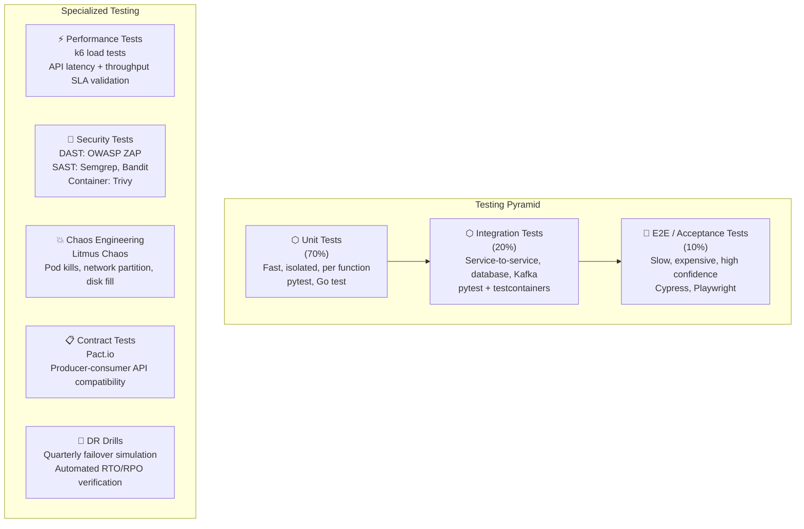

### 24.2 Test Coverage Requirements

| Service | Unit Test Coverage | Integration Tests Required | Performance Baseline |
|---|---|---|---|
| Ingestion Service | ≥ 85% | Kafka produce/consume, IoT Core integration | 10K events/sec per pod |
| Processing / ETL | ≥ 80% | Full pipeline: Kafka → QC → DB → S3 | 1TB/hour processing rate |
| API Service | ≥ 85% | All endpoints, auth flows, rate limiting | P99 < 200ms at 1K RPS |
| Alert Engine | ≥ 90% | Threshold evaluation, multi-channel dispatch | Alert in < 30s from event |
| Auth Service | ≥ 90% | OAuth flows, token refresh, RBAC enforcement | Token issuance < 50ms |

### 24.3 Chaos Engineering Programme

Litmus Chaos experiments are scheduled monthly in staging and quarterly in production:

| Experiment | Target | Expected Behavior |
|---|---|---|
| `pod-delete` | ingestion-service (50% pods) | HPA scales replacements in < 2min; no data loss |
| `node-drain` | 1 ingestion node group node | Pods rescheduled; Kafka consumers rebalanced in < 3min |
| `network-partition` | Ingestion → MSK network | Consumer reconnects with backpressure; no duplicate processing |
| `disk-fill` | Processing nodes | Alert fires at 85%; clean graceful degradation |
| `rds-failover-test` | RDS Multi-AZ | Automatic failover < 60s; application reconnects |
| `az-blackhole` | All pods in AZ-A | Load shifts to AZ-B and AZ-C; no user-visible impact |

---

## 25. Project Timeline (12 Weeks)

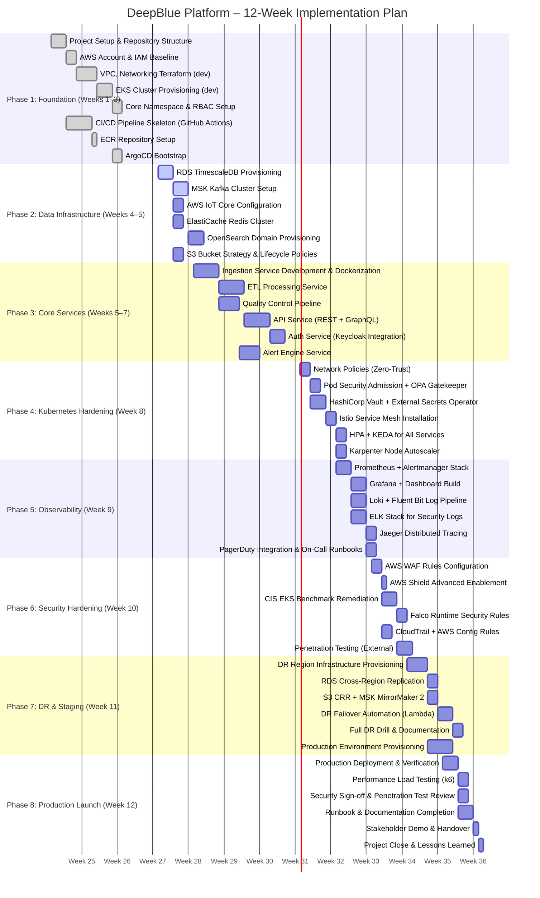

### Milestone Summary

| Milestone | Target Date | Deliverables |
|---|---|---|
| **M1: Foundation Complete** | End of Week 3 | Dev EKS running, CI/CD pipeline building images, ArgoCD deployed |
| **M2: Data Tier Online** | End of Week 5 | All data stores provisioned; ingestion service processing test data |
| **M3: Core Services Deployed** | End of Week 7 | All microservices deployed to dev; API accessible; auth working |
| **M4: Platform Hardened** | End of Week 9 | Security controls active; full observability stack operational |
| **M5: DR Validated** | End of Week 11 | DR drill completed; RTO/RPO verified; production provisioned |
| **M6: Production Launch** | End of Week 12 | Production live; load tested; documentation complete |

---

## 26. Team Roles and Responsibilities

### 26.1 Team Structure

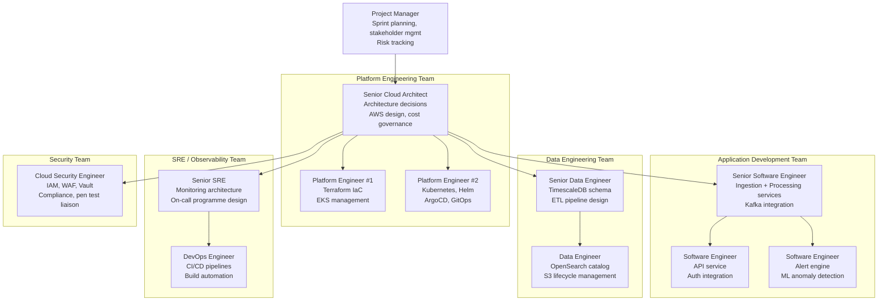

### 26.2 RACI Matrix

| Activity | PM | Cloud Architect | Platform Eng | App Dev | Data Eng | SRE | Security |
|---|---|---|---|---|---|---|---|
| Architecture Approval | I | **A/R** | C | C | C | C | C |
| Terraform IaC Development | I | A | **R** | I | I | C | C |
| Kubernetes Manifests | I | A | **R/C** | C | I | C | C |
| Application Development | I | A | I | **R** | C | I | I |
| CI/CD Pipeline | I | A | C | C | I | **R** | C |
| Database Schema | I | A | I | C | **R** | I | I |
| Monitoring Configuration | I | A | C | C | I | **R** | I |
| Security Controls | I | A | C | C | I | C | **R** |
| DR Plan & Drill | I | A | **R** | I | C | R | C |
| Cost Optimization | I | **R** | C | I | I | C | I |
| Documentation | C | R | R | **R** | R | R | R |
| Project Status Reporting | **R** | C | I | I | I | I | I |

*R = Responsible, A = Accountable, C = Consulted, I = Informed*

---

## 27. Conclusion

### Summary

The DeepBlue Oceanographic Research & Climate Intelligence Platform represents a comprehensive, enterprise-grade solution that transforms the research institute's fragmented on-premises infrastructure into a modern, cloud-native, globally distributed system. Through the systematic application of DevOps principles, cloud architecture best practices, and open-source tooling, the platform delivers on all stated objectives:

**Infrastructure Excellence:** The fully Terraform-automated AWS infrastructure eliminates manual provisioning, reducing environment spin-up time from weeks to under 30 minutes. Multi-AZ deployments with automated failover provide the 99.95% availability required for disaster preparedness operations.

**Development Velocity:** The GitOps-driven CI/CD pipeline, powered by GitHub Actions, Jenkins, and ArgoCD, transforms software delivery from monthly manual releases to multiple automated deployments per day. Every change is tested, security-scanned, and traceable from commit to production.

**Operational Visibility:** The comprehensive observability stack (Prometheus, Grafana, Loki, Jaeger, ELK) provides unprecedented visibility into every layer of the platform. Teams can detect and respond to incidents in under one minute, compared to the hours previously required to identify issues in siloed systems.

**Scientific Mission Alignment:** The platform is purpose-built for scientific workloads — from high-throughput sensor ingestion and real-time stream processing to GPU-accelerated ML anomaly detection and interactive JupyterHub research environments. The polyglot data tier ensures optimal performance characteristics for every access pattern.

**Security & Compliance:** The defense-in-depth security architecture, spanning edge protection through AWS Shield and WAF, down to runtime threat detection via Falco and dynamic secret management via HashiCorp Vault, ensures that sensitive scientific data and researcher information is protected at every layer.

**Resilience & Recovery:** The multi-region DR architecture with automated failover, 5-minute RPO, and 15-minute RTO provides the continuity required for mission-critical disaster early warning operations that cannot afford extended outages.

### Future Roadmap

| Initiative | Timeline | Value |
|---|---|---|
| Service mesh upgrade to Ambient mode (Istio Ambient) | Q1 2027 | Eliminate sidecar overhead; reduce resource consumption |
| Multi-cloud extension to GCP (Vertex AI integration) | Q2 2027 | Leverage GCP's Earth Engine for satellite data processing |
| Edge computing with AWS Outposts on research vessels | Q3 2027 | Real-time processing at sea with intermittent connectivity |
| Federated learning for ML model training | Q4 2027 | Train climate models across institutions without centralizing raw data |
| OpenTelemetry full-stack standardization | Q1 2027 | Consolidate tracing, metrics, and logs under a single collection standard |

### Key Takeaways for DevOps Practice

1. **Infrastructure as Code is non-negotiable** — every resource managed by Terraform ensures reproducibility, auditability, and eliminates configuration drift.
2. **GitOps closes the loop** — ArgoCD's reconciliation model means the cluster state always reflects what is in Git, providing a single source of truth and automatic drift correction.
3. **Observability must be designed in, not bolted on** — the RED method for service metrics and structured logging standards from day one ensure that every service is observable from its first deployment.
4. **Security is a shared responsibility** — integrating security scanning into CI, enforcing network policies, and running automated compliance checks makes security a continuous practice rather than a periodic audit.
5. **Disaster recovery requires regular practice** — a DR plan that has never been tested is not a DR plan. Quarterly drills with documented RTO/RPO measurements build confidence and reveal gaps before real incidents do.

---

*Document Version: 1.0.0 | DeepBlue Research Institute | Prepared June 2026*  
*Classification: University Submission – Final Year B.Tech DevOps Project*

---
