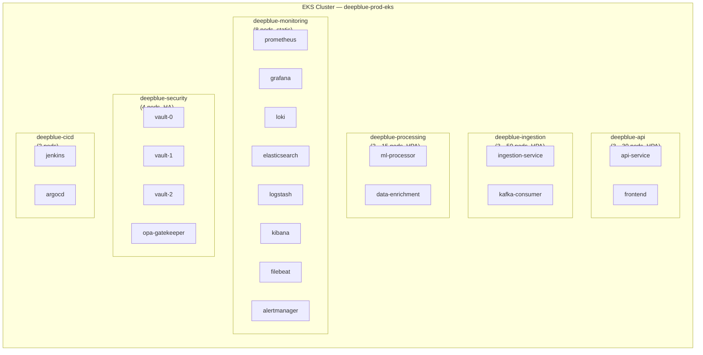

# DeepBlue — Deployment Diagram

**Author:** Saif Salmani | **Environment:** Production (AWS us-east-1)

---

## Cloud Infrastructure Deployment

```mermaid
graph TB
    subgraph Internet["🌐 Internet / End Users"]
        USERS[👥 Researchers & Scientists]
        SENSORS[🌊 Ocean Sensors & Buoys]
        SATELLITES[🛰️ Satellite Data Feeds]
    end

    subgraph AWS["☁️ AWS Cloud — us-east-1"]
        subgraph CDN["CloudFront CDN"]
            CF[CloudFront Distribution\ndeepblue.oceanresearch.io]
        end

        subgraph DNS["Route 53"]
            R53[Route 53\nHealth Checks + Failover]
        end

        subgraph WAF["Security Layer"]
            WAFV2[AWS WAF v2\nDDoS Protection]
        end

        subgraph VPC["VPC — 10.0.0.0/16"]
            subgraph PublicSubnets["Public Subnets (10.0.0.0/24, 10.0.1.0/24, 10.0.2.0/24)"]
                ALB[Application Load Balancer\nHTTPS + SSL Termination]
                NAT[NAT Gateway\n3x for HA]
                BASTION[Bastion Host\nSSM Session Manager]
            end

            subgraph PrivateSubnets["Private Subnets (10.0.10.0/24, 10.0.11.0/24, 10.0.12.0/24)"]
                subgraph EKS["EKS Cluster — deepblue-prod-eks (K8s 1.29)"]
                    subgraph NS_API["Namespace: deepblue-api"]
                        API1[api-service\nPod 1]
                        API2[api-service\nPod 2]
                        API3[api-service\nPod 3]
                        APIHPA[HPA: 3→30 pods\nCPU > 70%]
                    end
                    subgraph NS_ING["Namespace: deepblue-ingestion"]
                        ING1[ingestion-service\nPod 1]
                        ING2[ingestion-service\nPod 2]
                        ING3[ingestion-service\nPod 3]
                        INGHPA[HPA: 3→50 pods\nKafka Lag > 1000]
                    end
                    subgraph NS_PROC["Namespace: deepblue-processing"]
                        PROC1[processing-service\nPod 1]
                        PROC2[processing-service\nPod 2]
                    end
                    subgraph NS_MON["Namespace: deepblue-monitoring"]
                        PROM[Prometheus]
                        GRAF[Grafana]
                        LOKI[Loki]
                        ES[Elasticsearch]
                        LOG[Logstash]
                        KIB[Kibana]
                    end
                    subgraph NS_SEC["Namespace: deepblue-security"]
                        VAULT[HashiCorp Vault\nHA 3 nodes]
                        OPA[OPA/Gatekeeper]
                    end
                    subgraph NS_CICD["Namespace: deepblue-cicd"]
                        JENKINS[Jenkins\nCI Server]
                        ARGO[ArgoCD\nGitOps]
                    end
                    KARPENTER[Karpenter\nNode Autoscaler]
                end
            end

            subgraph DataSubnets["Data Subnets (10.0.20.0/24, 10.0.21.0/24, 10.0.22.0/24)"]
                subgraph RDS["RDS Multi-AZ"]
                    RDS_P[TimescaleDB Primary\nus-east-1a]
                    RDS_S[TimescaleDB Standby\nus-east-1b]
                end
                MSK[MSK Kafka\n3 Brokers × 3 AZs]
                REDIS[ElastiCache Redis\n3 Shards × 3 AZs]
                OS[OpenSearch\n3 Nodes]
            end
        end

        subgraph Storage["Object Storage"]
            S3_RAW[S3: deepblue-raw-data\n68.4 TB]
            S3_PROC[S3: deepblue-processed]
            S3_ML[S3: deepblue-ml-models]
            S3_TF[S3: deepblue-tf-state]
        end

        subgraph IAM["Identity & Security"]
            IAM_ROLES[IAM Roles\nIRSA per namespace]
            KMS[KMS Keys\nVault unseal + S3]
            SM[Secrets Manager\nBootstrap only]
        end

        subgraph Observability["Monitoring & Alerting"]
            CW[CloudWatch\nLogs + Metrics]
            PD[PagerDuty\nAlerting]
        end
    end

    subgraph DR["🔄 DR Region — eu-west-1 (Standby)"]
        EKS_DR[EKS Cluster\nStandby — 2 pods each]
        RDS_DR[RDS Read Replica\nAuto-promote on failover]
        S3_DR[S3 Cross-Region\nReplicated buckets]
        MSK_DR[MSK Mirror\nKafka MirrorMaker 2]
    end

    subgraph CICD_EXT["🔧 CI/CD (External)"]
        GITHUB[GitHub\nSaif09inAction/DeepBlue]
        ECR[AWS ECR\nDocker Image Registry]
    end

    %% Traffic flows
    USERS --> CF
    SENSORS --> ALB
    SATELLITES --> ALB
    CF --> WAF
    R53 --> CF
    WAFV2 --> ALB
    ALB --> API1
    ALB --> API2
    ALB --> API3

    %% Ingestion flow
    ING1 --> MSK
    ING2 --> MSK
    ING3 --> MSK
    MSK --> PROC1
    MSK --> PROC2
    PROC1 --> RDS_P
    PROC1 --> S3_RAW
    PROC2 --> RDS_P

    %% API to data stores
    API1 --> RDS_P
    API1 --> REDIS
    API2 --> REDIS

    %% Monitoring
    API1 -.->|metrics| PROM
    ING1 -.->|metrics| PROM
    PROM -.->|alerts| PD
    GRAF -.->|dashboards| PROM
    LOG --> ES
    KIB --> ES

    %% Secrets
    API1 -.->|secrets| VAULT
    ING1 -.->|secrets| VAULT

    %% DR replication
    RDS_P -.->|async replication| RDS_DR
    S3_RAW -.->|CRR| S3_DR
    MSK -.->|MirrorMaker| MSK_DR

    %% CI/CD
    GITHUB -->|webhook| JENKINS
    JENKINS -->|push image| ECR
    GITHUB -->|GitOps sync| ARGO
    ECR -->|pull image| EKS

    classDef aws fill:#FF9900,color:#000,stroke:#FF9900
    classDef k8s fill:#326CE5,color:#fff,stroke:#326CE5
    classDef security fill:#DD344C,color:#fff,stroke:#DD344C
    classDef data fill:#3F8624,color:#fff,stroke:#3F8624
    classDef monitor fill:#6D28D9,color:#fff,stroke:#6D28D9
    classDef cicd fill:#24292E,color:#fff,stroke:#24292E

    class ALB,NAT,R53,CF,KMS,IAM_ROLES,SM,CW aws
    class API1,API2,API3,ING1,ING2,ING3,PROC1,PROC2,KARPENTER k8s
    class VAULT,OPA,WAFV2 security
    class RDS_P,RDS_S,MSK,REDIS,OS,S3_RAW,S3_PROC data
    class PROM,GRAF,LOKI,ES,LOG,KIB,PD monitor
    class JENKINS,ARGO,GITHUB,ECR cicd
```



---

## Kubernetes Namespace Layout



---

## Network Flow Diagram

```
Internet Users
     │  HTTPS :443
     ▼
CloudFront CDN ──── WAF (Rate limit, SQLi, XSS protection)
     │
     ▼
Route 53 (Health-checked DNS)
     │
     ▼
Application Load Balancer (HTTPS :443 → HTTP :8080)
     │  ┌──────────────────────────────────┐
     │  │ Target Group: deepblue-api pods  │
     │  │ Health check: GET /health        │
     │  └──────────────────────────────────┘
     ▼
EKS Nodes (Private subnet, no public IPs)
     │
     ├── deepblue-api pods ──────▶ RDS :5432 (PostgreSQL/TimescaleDB)
     │                        ──▶ ElastiCache :6379 (Redis)
     │                        ──▶ Vault :8200 (secrets via IRSA)
     │
     ├── ingestion pods ─────────▶ MSK Kafka :9092 (TLS)
     │                        ──▶ S3 (via VPC Endpoint, no internet)
     │
     └── processing pods ────────▶ MSK Kafka :9092 (consume)
                             ──▶ RDS :5432 (write results)
                             ──▶ S3 (write processed data)

All outbound internet traffic → NAT Gateway (private subnets)
AWS API calls → VPC Endpoints (no internet egress for S3, ECR, etc.)
```

---

## Deployment Pipeline Flow

```
Developer pushes code
        │
        ▼
   GitHub (main branch)
        │
        ├──▶ GitHub Actions (lint, test, scan)
        │
        └──▶ Jenkins (multi-stage pipeline)
              │
              ├── Lint & Test
              ├── Security Scan (Trivy)
              ├── Build Docker Images
              ├── Push to ECR
              ├── Terraform Plan/Apply
              │
              └── ArgoCD detects Git change
                     │
                     ▼
               EKS Rolling Update
               (0 downtime, readiness probes)
```
